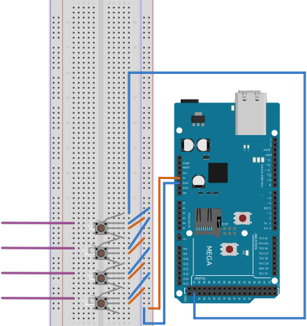

# push-push-push-game

## Required Hardwarde

- Arduino AT Mega
- Arduino Ethernet Shield
- Adafruit NeoPixels

## Getting started

- Connect the Arduino to the appropriate pins on a the LED breadboard
- Connect your machine to the Arduino Ethernet shield
- Power up the Arduino
- Perform steps for Local Development Environment if necessary
- In Network Settings, configure "Thunderbolt Ethernet" to
  - Manual
  - IP-Address: 192.168.1.199
  - Subnet-Mask: 255.255.255.0

## Local Development Environment
- Atom Editor `latest`
- platformIO `latest`
- Python
- NodeJS `>= 6`

### Arduino development

```sh
# Given atom is installed
# Given you are connected to the Arduino
apm install platformio-ide
pip install -U platformio
atom arduino/
cd arduino/

# Install platformio depdencies as per blue Atom Notification
# Restart Atom as per the green Atom Notification
# No platformio Account required

platformio update
# GUI Equivalent:
# PlatformIO => Initialize or Update PlatformIO Project
# Selected board: Arduino Mega or Meta 2560 ATmega2560 (Mega 2560)
# Click "Process"

platformio run
# GUI Equivalent:
# PlatformIO => Build

platformio run --target upload
# PlatformIO => Upload

platformio pio device monitor --port /dev/usbmodem1421
# GUI Equivalent
# PlatformIO => Serial Monitor
# Generic CDC at /dev/usbmodem1421
```

### Node server development

```
node simple-server.js
```

## Architecture

- C++ Program running on Arduino ATM Mega reads button states, sets NeoPixel stats per GPIO
- C++ Program listens on `192.168.100:8888` for UDP packets
- C++ Program sends UDP state packets to `192.168.1.199:777`
- NodeJS server listens on `localhost:777` for UDP state packets
- NodeJS server sends UDP command packets to `192.168.100:8888`

## Hardware layout


